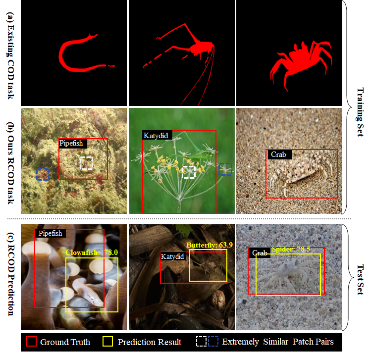

## Toward Realistic Camouflaged Object Detection: Benchmarks and Method




## Dataset Link
[Google](https://drive.google.com/drive/folders/1SafBDHRbutQ4D3yqDPOEmZY2u9Ip7Feh) 

[Baidu](https://pan.baidu.com/s/11m8pSerp4hR6pMZMD7WiyQ?pwd=93yd)  Extract Code: 93yd 
   

| Datasets | Categories | Training Images | Test Images |
| ---- | ---- | ---- | ---- |
| COD10K-D | 68 | 6000 | 4000 |
| NC4K-D | 37 | 2863 | 1227 |
| CAMO-D | 43 | 744 | 497 |


## Framework install

Our code is based on MMDetection. Here, for the convenience of readers, we have uploaded the full code of mmdetection and our code. If the relevant environment for mmdetection is configured on your server, you can download and use it directly. MMDetection is an open source object detection toolbox based on PyTorch. We adopt MMDetection as our baseline framework from [MMdetection](https://github.com/open-mmlab/mmdetection)


**Our environmental installation**
* Linux with Python >= 3.10
* conda create -n RCOD python==3.10
* conda activate RCOD
* [PyTorch](https://pytorch.org/get-started/locally/) >= 2.1.1 & [torchvision](https://github.com/pytorch/vision/) that matches the PyTorch version.
* Our CUDA is 11.8
* Install PyTorch 2.1.1 with CUDA 11.8 
  ```shell
  conda install pytorch==2.1.1 torchvision==0.16.1 torchaudio==2.1.1 pytorch-cuda=11.8 -c pytorch -c nvidia
  ```
* pip install mmcv>=2.2.0
* pip install -r requirements/build.txt
* pip install -v -e . 

**Training on APG**

We wrote the config files of the three datasets together, so the number of categories in the config file and the path of the dataset needed to be changed during training.

  ```shell
  CUDA_VISIBLE_DEVICES=0,1,2,3 bash ./tools/dist_train.sh "--config configs/glip/glip_swin_tiny_cafr.py --work-dir /home/output 4
  ```
**Training on SFR**

coming soon~


## Citation

If you use this toolbox or benchmark in your research, please cite this project.

```
@article{RCOD,
 
}
```


